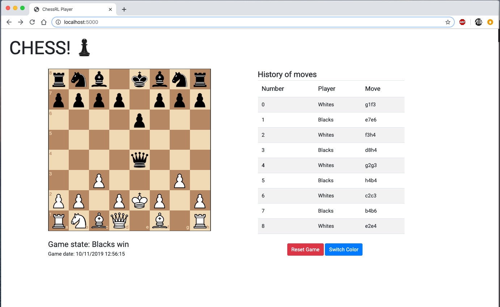

# ChessRL Web Client

This is a simple web GUI for playing with the trained AI.

This artifact is made with Flask, which sets up a simple REST API and JS, as the
client. The client uses JQuery and *chessboardjs* for presenting a simple chessboard
on the screen and making calls to the API.



## Requirements
If you want to launch it up you will need Flask installed:

```bash
pip install flask
```

## Launch it!

Simply with:

```bash
python run.py
```

And navigate to http://localhost:5000


### API specification

The REST API currently supports the following methods:

| Route      |  HTTP request type    |  Description     |
|:----------:|:---------------------:|------------------|
| /          |   GET                 | Renders an HTML with the client |
| /game      |   GET                 | Returns the current game metadata|
| /game      |   DELETE              | Destroys the current game (and its engine)|
| /game/color      |   PUT              | Updates (Destroys and creates another) the game with the new player's color (0=blacks, 1=whites)| 
| /game/move      |   POST              | The player make a move (move encoded as UCI, i.e. e2e3)| 

